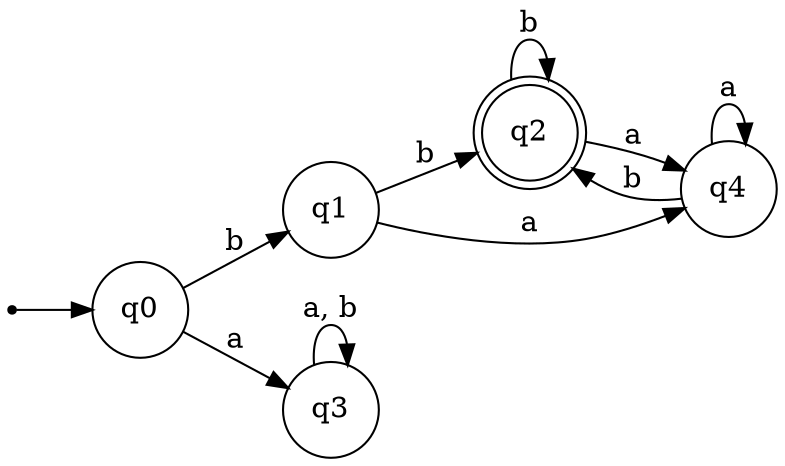
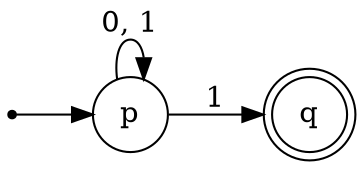
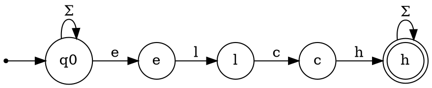
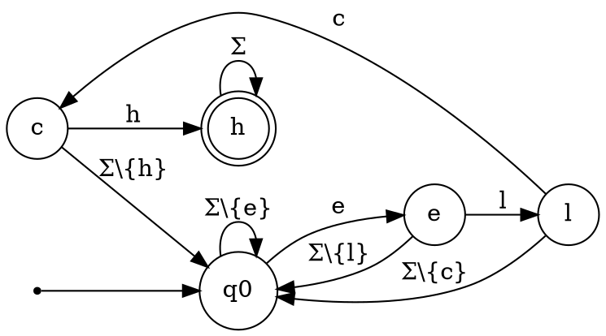

# Endliche Automaten

In diesem Post geht es um das neue Thema des Leistungskurses: *Endliche Automaten*.
Mit ihnen kann man auf eine einfache Art komplexe Abläufe modellieren, man findet sie auch in Eingabevalidierungen oder Compilern.



## Was ist überhaupt ein Automat?

Ein Automat besteht aus *Zuständen* und *Übergängen*.
Das obige Bild nennt man einen *Übergangsgraphen*: Zustände werden als Knoten gezeichnet, Übergänge als Kanten.

Ein Automat nimmt nun eine Eingabe entgegen und überprüft, ob sie angenommen wird.
Die Eingabe nennt man *"Wort"*, wird sie angenommen, gehört sie zur *"Sprache"* des Automaten.
Damit dieser Fachterminus einfacher verständlich ist, hier ein Beispiel:

Der obige Automat hat das Eingabe-Alphabet $\Sigma = \{a; b\}$.
Dies kann man an den Beschriftungen der Übergänge ablesen.
Nun füttert man diesen Automaten mit einem *"Wort"*, in unserem Beispiel mit `baab`.
Man steigt bei $q_0$ in den Automaten ein und schaut sich das erste Zeichen des Wortes an, dann folgt man dem entsprechenden Übergang.
In unserem Beispiel ist das ein `b`, der erste Übergang ist also $q_0 \rightarrow q_1$.
Dies wird für jedes Zeichen wiederholt:

$$
q_0
\xrightarrow{b}
q_1
\xrightarrow{a}
q_4
\xrightarrow{a}
q_4
\xrightarrow{b}
q_2
$$

Die Eingabe `baab` führt also in den Zustand $q_2$.
Da dieser ein Endzustand ist (erkennbar an der doppelten Umrandung), wird das Wort angenommen und gehört somit zur Sprache des Automaten.

Die Eingabe `bba` wird hingegen nicht angenommen:

$$
q_0
\xrightarrow{b}
q_1
\xrightarrow{b}
q_2
\xrightarrow{a}
q_4
$$

Sie endet in $q4$, dies ist kein Endzustand.

Hat ein Zustand keinen Übergang, der von ihm weg führt, nennt man ihn "Senke".
Landet man einmal in ihm, kommt man nicht mehr heraus.
In unserem Beispiel ist $q3$ eine Senke.

## Formale Definition

Ein Übergangsgraph kann einen Automaten sehr anschaulich beschreiben, für die Implementation ist aber eine formale Definition sehr hilfreich.

Diese besteht aus fünf Teilen:

$$
A = (Q, \Sigma, \delta, q_0, F)
$$

$Q$ ist die Menge aller Zustände.

$$
Q = \{ q_0; q_1; q_2; q_3; q_4 \}
$$

$\Sigma$ ist das Eingabealphabet.

$$
\Sigma = \{ a; b \}
$$

$\delta$ ist die Übergangsfunktion.
Sie bestimmt aus dem aktuellem Zustand und dem nächsten Zeichen den nächsten Zustand.

|$\delta$| a  | b  |
|--------|----|----|
| **q0** | q3 | q1 |
| **q1** | q2 | q4 |
| **q2** | q4 | q2 |
| **q3** | q3 | q3 |
| **q4** | q4 | q2 |

$q_0$ ist der Anfangszustand.

$F$ ist die Menge aller Endzustände, in denen das Wort angenommen wird.

$$
F = \{ q_2 \}
$$

Der Beispiel-Automat ist ein ***D**eterministischer* ***E**ndlicher* ***A**utomat* (DEA).

*Deterministisch* bedeutet, dass bei jedem Zustand für jede Eingabe eindeutig bestimmt ist, in welchen Zustand übergangen wird.

*Endlich* beschreibt, dass der Automat eine endliche Anzahl an Zuständen besitzt.

Es gibt auch andere Arten von Automaten, eine davon wirst du später kennenlernen.

## Implementation

Ein DEA ist vergleichsweise einfach zu implementieren.
Eine mögliche Implementation des Beispiel-DEAs kannst du hier sehen:

```java
class ExampleDEA {
  
  int BEGINNING_STATE = 0;

  int[] END_STATES = new int[]{ 2 };

  public boolean matches(String value) {
    int state = BEGINNING_STATE;

    for (char c : value.toCharArray()) {
      state = this.nextState(state, c);
    }

    // Pseudo-Code
    return END_STATES.contains(state);
  }

  private int nextState(int currentState, char c) {
    switch (currentState) {
      case 0:
        return c == 'a' ? 3 : 1;
      case 1:
        return c == 'a' ? 2 : 4;
      case 2:
        return c == 'a' ? 4 : 2;
      case 3:
        return c == 'a' ? 3 : 3;
      case 4:
        return c == 'a' ? 4 : 2;
      default:
        return -1;
    }
  }

}
```

Die Methode `nextState` modelliert die Übergangstabelle $\delta$, die Methode `matches` verwendet diese um einen Eingabewert auf seine Gültigkeit zu überprüfen.

### Nicht-Deterministische Endliche Automaten

Im Gegensatz zu DEAs ist bei Nicht-Deterministischen Endlichen Automaten (NEA) der Übergangsgraph nicht eindeutig.
Das könnte so aussehen: Bist du bei $p$ und hast $1$ eingelesen, kannst du entweder nach $p$ oder $q$ gehen.



Dieser Automat nimmt alle Eingabewerte an, für die es mindestens einen Weg zum Zielzustand gibt.
Gültige Werte wären zum Beispiel:

$$
p
\xrightarrow{1}
q
$$

$$
p
\xrightarrow{1}
p
\xrightarrow{0}
p
\xrightarrow{1}
q
$$

Ungültige Werte wären

$$
p
\xrightarrow{0}
q
$$

$$
p
\xrightarrow{1}
p
\xrightarrow{0}
p
\xrightarrow{0}
p
$$

Dieser Automat nimmt alle Eingaben an, die auf $1$ enden.

NEAs können sehr hilfreich sein, um komplexe Automaten herunter zu brechen.

Man stelle sich einen Spamfilter vor, der Emails auf das Wort "Elch" untersucht.
Mit einem NEA kann dieser sehr überschaubar dargestellt werden:



Als DEA wäre dieser Automat sehr komplex:



Interessant ist: Jeder DEA lässt sich als NEA darstellen und umgekehrt.
Ein NEA ist also nur eine einfachere Darstellung.

Jeder DEA ist schon ein NEA, eine Überführung in die andere Richtung kann man mithilfe der [Potenzmengenkonstruktion](https://de.wikipedia.org/wiki/Potenzmengenkonstruktion) durchführen.

## Reguläre Ausdrücke

Die Darstellung solcher Automaten in Übergangsgraphen ist anschaulich, aber oft zu sperrig.
Damit man Automaten dem Computer gut beibringen kann, gibt es Reguläre Ausdrücke.

$$
L = \{ w \in \Sigma^* \mid w = ab(a+b)^*b+ \}
$$

Dieser Reguläre Ausdruck besagt:
Meine Sprache sind alle Wörter $w$ aus $\Sigma^*$ (Menge aller Wörter, die man aus dem Alphabet $\Sigma$ bilden kann), für die gilt:

1. Es beginnt mit $ab$
2. Es folgt $0$ oder öfter mal $a$ oder $b$
3. Es folgt mindestens ein mal $b$

Es gibt vier grundlegende Operatoren:

$a?$: Einmal oder keinmal $a$
$a^*$: Keinmal oder mehrmals $a$
$a+$: Ein oder mehrmals $a$
$a+b$: $a$ oder $b$

Diese Operatoren können beliebig kombiniert werden.

Der Reguläre Ausdruck $(a+..+z)^*elch(a+..+z)^*$ macht das selbe wie obiger NEA.

Unterstützung für Reguläre Ausdrücke, oder kurz *RegEx* (Regular Expression), ist in fast allen Sprachen schon eingebaut.

Das obige Elch-Beispiel in einigen Sprachen:

**Java:**
```java
Pattern pattern = Patter.compile(".*elch.*");
Matcher m = p.matcher("Ein Elch läuft über die Straße.");
m.matches();
```

**Javascript:**
```js
const regex = /.*elch.*/i;
regex.test("Ein Elch läuft über die Straße.");
```

**Python:**
```python
re.match(".*elch.*", "Ein Elch läuft über die Straße.");
```

